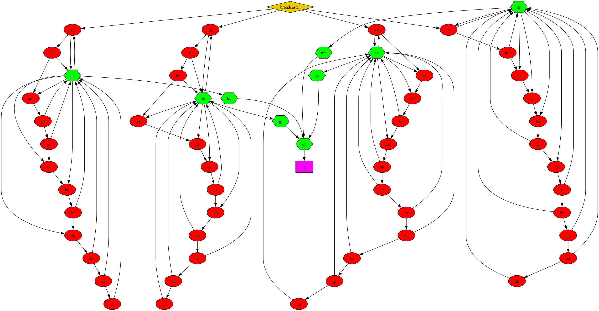

## Day 20

I am once again asking for you to visualise your inputs.

Today's part 2 wasn't to my taste :C

## The input:

In order to parse my input, I have made three data structures:
```hs
data State  = On   | Off deriving (Show, Eq)
data Pulse  = High | Low deriving (Show, Eq)
data Module = Broadcaster { connected :: [String] }         |
              Flip { state :: State, connected :: [String]} |
              Conjunction { inputs :: Map String Pulse, connected :: [String] } deriving (Show, Eq)
```

State represent the state of a flipflop module (On or Off), Pulse is a type of pulse that can be send between modules (Low or High), and Module represents one of three types of modules:
 - The Broadcaster module (our starting point in the module graphs) which only as children
 - The Flip module (flipflop module) which has a state and children
 - The Conjunction module which has a memory of input pulses and children.

About that last data structure, I also have a isConjunction function that does exactly what it says:
```hs
isConjunction :: Module -> Bool
isConjunction (Conjunction _ _) = True
isConjunction _                 = False
```

I represent my input as a Map, mapping each module name to the actual module:
```hs
type Input = Map String Module
```

Now to parse the module:
```hs
parseInput :: String -> Input
parseInput input  = foldr getInputs modules $ keys modules
    where modules = fromList . map (parseLine . words) . lines $ input
          getInputs name ms = foldr (adjust (addInput name) ) ms [child | child <- connected (ms ! name),
                                                                                             child `member` ms,
                                                                                             isConjunction  (ms ! child)]
          addInput input m = m { inputs=insert input Low $ inputs m}
          parseLine (name : _ : xs) | head name == '&' = (tail name, Conjunction { inputs=empty, connected=children } )
                                    | head name == '%' = (tail name, Flip        {  state=Off  , connected=children } )
                                    | otherwise        = (    name , Broadcaster {               connected=children } )
                                    where children = map (filter (/= ',')) xs
```
I create my Map in two parts:
 - First I parse each line from my file to make the corresponding module
 - Then for each module that has a conjunction module in its children I update the conjunction module's input Map to add the input module.

## Sending pulses:

In order to represent the state of our whole circuit after each button pressing, I define an Iteration data structure:
```hs
data Iteration = Iteration { modules :: Input, presses :: Int, cycling :: Map String Int, lows :: Int, highs :: Int }
                    deriving (Show, Eq)
```

The modules field of the structure is our actual circuit (our modules). Presses is the number of times the button has been pressed to get to that state.
Cycling is a secret tool that will be useful for later. lows is the number of times low pulses have been send during that iteration, and highs is the same for high pulses.

Now, sending pulses works with a queue:

 - Case 1: The queue is empty. This means that we're done with that iteration and we can simply return it
```hs
doIteration :: [(String, String, Pulse)] -> Iteration -> Iteration
doIteration [] it = it
```

 - Case 2: The queue only has a Low signal sent to the broadcaster. This means we've just pressed the button, and this is the start of our iteration. Our queue will be populated with pulses from broadcaster to its children, and we update the low counter
```hs
doIteration [(_, "broadcaster", Low)] it = doIteration [("broadcaster", c, Low) | c <- children] (it { lows=l' })
                                              where children = connected $ modules it ! "broadcaster"
                                                    l'       = lows it + length children
```

 - Case 3: We handle the first signal in our queue:
  - Case 3a: The receiving module is a leaf in our graph. Then we simply don't send any new signal and we keep going with our queue
    ```hs
    doIteration ((sender, name, pulse):queue)  it | name `notMember` modules it            = doIteration queue it
    ```
  - Case 3b: The receiving module is a flipflop module and the pulse was high. Then we don't send any new signal either and we keep going with our queue (however we update the cycling field. This is for part 2 so I will explain it later)
    ```hs
                                                  | pulse == High && not (isConjunction m) = doIteration queue it { cycling = c' }
    ```
  - Case 3c: The receiving module will send a new signal. We need to update the queue by adding the new signals, as well as updating the state of our circuit:
      ```hs
                                                  | otherwise                              = doIteration queue' it'
                                                  where m = modules it ! name
                                                        -- Update cycle length of inputs of conjunction module connected to rx
                                                        c' | pulse /= High || "rx" `notElem` connected m = cycling it
                                                           | otherwise = insert sender (presses it) (cycling it)
 
                                                        -- Update the module
                                                        m' | isConjunction m = m { inputs = adjust (const pulse) sender (inputs m) }
                                                           | state m == On   = m { state = Off }
                                                           | otherwise       = m { state = On  }
 
                                                        -- Get the next pulse to send
                                                        getPulse (Conjunction ins _) | all (== High) $ elems ins = Low
                                                                                     | otherwise                 = High
                                                        getPulse (Flip On _)         = High
                                                        getPulse (Flip Off _)        = Low
                                                        p' = getPulse m'
 
                                                        -- Add this pulse to the send queue
                                                        queue' = queue ++ [(name, child, p') | child <- connected m']
 
                                                        -- Update the iteration: modules and counters
                                                        l'     | p' == High = lows  it
                                                               | otherwise  = lows  it + length (connected m')
                                                        h'     | p' == Low  = highs it
                                                               | otherwise  = highs it + length (connected m')
                                                        mods'  = adjust (const m') name $ modules it
                                                        it'    = it { modules = mods', cycling = c', lows = l', highs = h' }
    ```

Now that we know how to send pulses and propagate them, we can define a function that kickstart an iteration (ie, a button press from a given state):
```hs
doNextIteration :: Iteration -> Iteration
doNextIteration (Iteration it n c _ _) = doIteration [("button", "broadcaster", Low)] (Iteration it (n + 1) c 1 0)
```

Obviously, when the button gets pressed, the presses counter increases while the low and high counters get reset. (low is set to one to account for the low pulse from button to broadcast)

Now we can define a function that performs a given number of button presses:
```hs
doNIterations :: Int -> Input -> [Iteration]
doNIterations n input = take n . tail . iterate doNextIteration $ Iteration input 0 empty 0 0
```
This creates all iterations of our input, removes the starting iteration state and returns all of the states from the first button press to the nth.

Now to solve part one we simply need to perform 1000 button pressed, sum all of the low counter, sum all of the high counters and multiply the two results together:
```hs
partOne :: Input -> Output
partOne input = (sum . map lows) iterations * (sum . map highs) iterations where iterations = doNIterations 1000 input
```

## [The part where the input's properties kill you](https://www.youtube.com/watch?v=hOXrgDDLpYw):

Alright, let's talk about part 2. If you try to run a naive solution, you're going to wait quite a long time before getting a result!

So you obviously need to find an optimised solution right? WRONG! 😸

Today is one of those days where observing the input is important. So let's do it!

Here is what my input looks like:
(Flipflops are the ellipsoid nodes and Conjunctions are the hexagonal ones)



Notice some interesting things here:
 - rx doesn't have children
 - rx is the child of a single conjunction node
 - this conjunction node is the child of four other conjunction nodes
 - which themselves are the children of singular conjunction nodes each.
 - the whole graph seems to be split into four parts

So, considering that, here was my intuition (literally copy-pasted from a discussion I had with my friend Adam):
```
ok so intuition:
 - Every input for the conjunction thingy is going to send High with the same interval everytime
 - So for example, if the inputs are a b c and d, maybe a is going to send High every ten presses, b every seven, c every two and d every one thousand
 - So I need to take the lcm of these cycle lengths
Proof:
 - This is an AOC problem, so there are cycles involved
```

Which is true, but the actual reason is quite interesting (and you might have noticed it already):

These four parts are actually four binary counters!

I have found this [nice visualisation](https://www.reddit.com/media?url=https%3A%2F%2Fpreview.redd.it%2Fv99dyk6dtf7c1.gif%3Fformat%3Dmp4%26s%3Dc4cd39ea42974da5b79882ca3c7bdedf9f1fae1f) which makes it clearer I believe.

The TL;DR is: because these are binary counters, their overall states will form a cycle. So we have four sub-cycles that we want to be in their last state all at the same time.

This is exactly like Day 8! (which is why I won't reexplain why we need to take the lcm. Check out my writeup for day 8 if you're curious!)

So, remember that cycling field that I kept secret during my explanation for part 1? Well its only job is to now how many button presses are needed for one of the four counter's input to send a high pulse.

Therefore, when we're sending a High pulse to the node right before the rx module, we keep track that the sender's cycle length is the number of button pressed so far!
```hs
                                                    -- Update cycle length of inputs of conjunction module connected to rx
                                                    c' | pulse /= High || "rx" `notElem` connected m = cycling it
                                                       | otherwise = insert sender (presses it) (cycling it)
```

Now what we can do is to perform button presses until we've found the cycle length of each of the input of the rx's input:

```hs
partTwo :: Input -> Output
partTwo input = foldr1 lcm . elems $ cycling iterations
    where mustBeHigh = keys . inputs . fromJust . find (("rx" `elem`) . connected) . elems $ input
          allFound it = all (`elem` (keys $ cycling it)) mustBeHigh
          iterations  = head . dropWhile (not . allFound) . tail . iterate doNextIteration $ Iteration input 0 empty 0 0
```

Of course this is quite suboptimal. Considering that these are binary counters, there is surely a way to maths your way in with some pen and paper and some simple formulas. But I couldn't be bothered thinking about that!
