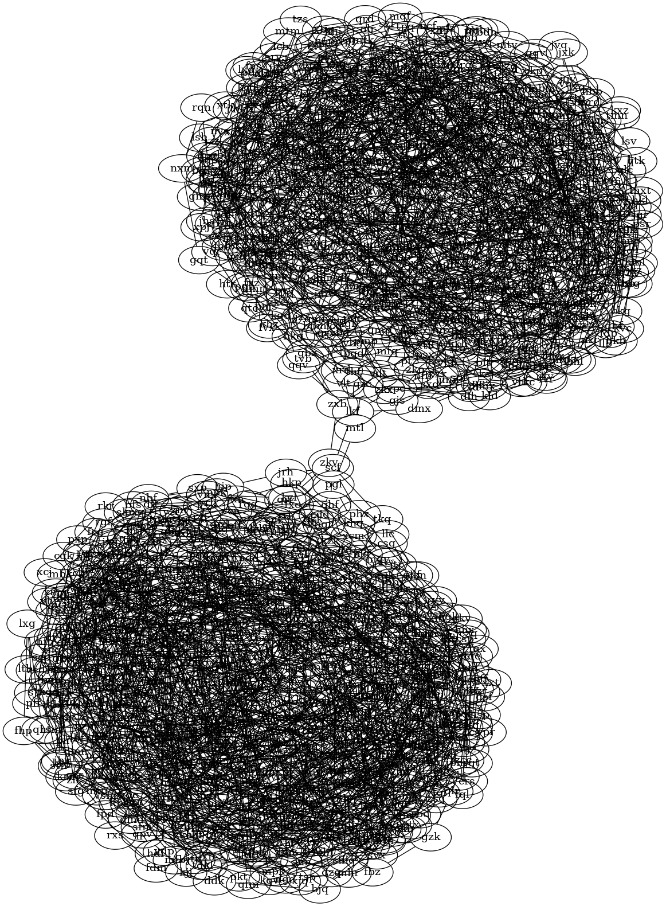

## Day 25

Merry christmas everyone!

This write-up will be split in two parts:
 - The actual write-up
 - My feelings about this year's AoC

# Part 1: The write-up

## The input:

The input is just an undirected graph. I will represent it using adjacency lists that I put in a map.

For each line of my input, I add all the edges in my graph (so for each successor of a node in my input, I have to add two edges,
e.g `a: b c` I have to add edges (a, b) (b, a) (a, c) and (c, a))

```hs
parseInput :: String -> Input
parseInput = foldr (makeGraph . words) M.empty . lines
    where addOtherEdge succ node        = M.insertWith (++) node [succ]
          makeGraph (node : succ) graph = foldr (addOtherEdge nodeName) graph' succ
            where nodeName = init node
                  graph'   = M.insertWith (++) nodeName succ graph
```

[insertWith](https://hackage.haskell.org/package/containers-0.7/docs/Data-Map-Strict.html#v:insertWith) allows me add all the successors of a node in the graph, and inserting the node in the graph if it is not already present.

For each node entry in my input, I add all the successors of the node (and the node itself) in the graph, and for each successor I add the node in its adjacency list.

## Solving the problem:

Solving today's problem is not really hard. What the problem is asking is to find the [minimum cut](https://en.wikipedia.org/wiki/Minimum_cut) of the graph. There are mutiple ways to go on with that:
 - Using the [Stoer-Wagner algorithm](https://en.wikipedia.org/wiki/Stoer-Wagner_algorithm)
 - Using [Karger's algorithm](https://en.wikipedia.org/wiki/Karger%27s_algorithm) (which is a monte-carlo algorithm, basically you need to run it multiple times and see what the most frequent result is)
 - Finding the paths between many pairs of nodes and getting the three most frequent nodes in these paths

However, there is one last solution that is not as automatic, but paradoxily is easier and faster to implement: looking at the graph.



[neato](https://graphviz.org/docs/layouts/neato/) is a tool for visualising graphs that tend to group together "clusters" in a graph. With this, the three edges connecting the two clusters are quite easy to see, and all is left to do is to remove them manually!

What my code does is therefore the following:
 - I represent my graph in [dot language](https://graphviz.org/doc/info/lang.html)
 - I visualise it with neato
 - I display it (I chose pdf and xdg-open because I am actually coding over ssh, and these proved to be the fastest with X11Forwarding)
 - I prompt the edges to remove (a comma separated list of pairs in format '("node1", "node2")')
 - I remove them from the graph
 - I launch a flood-fill from one of the nodes to get the size of one component
 - I get the size of the other by subtracting the size of the component to the total size
 - I multiply them to get my result

```hs
getDot :: Input -> String
getDot input = "graph {\n\t" ++ nodes ++ "\n}"
    -- When getting the successors of the node, I get only the successors that are ordered before this node. This is to make sure that the edge (a, b) is only created once
    where nodes = intercalate "\n\t" [key ++ " -- {" ++ intercalate ", " (filter (> key) succ) ++ "};" | (key, succ) <- M.assocs input]

-- I remove a from the successors of b, and b from the successord of a
removeEdge :: Input -> (String, String) -> Input
removeEdge graph (a, b) = M.adjust (filter (/= b)) a $ M.adjust (filter (/= a)) b graph

-- Flood-fill from a node to get the nodes of a component
getComponent :: Input -> S.Set String
getComponent graph = bfs (S.singleton start) [start]
    where start = (head . M.keys) graph
          bfs seen []        = seen
          bfs seen (x:queue) = bfs seen' queue'
            where neighbours = filter (`S.notMember` seen) $ graph M.! x
                  seen'      = S.union seen $ S.fromList neighbours
                  queue'     = queue ++ neighbours

partOne :: Input -> IO Output
partOne input = do
    let extension = "pdf"
    let filename  = "graph." ++ extension

    file <- openFile filename WriteMode

    (Just hin, _, _, _) <- createProcess (proc "neato" ["-T" ++ extension]){ std_out = UseHandle file, std_in = CreatePipe }
    hPutStrLn hin $ getDot input
    hClose hin

    _ <- createProcess (proc "xdg-open" [filename])
    hClose file

    putStrLn "Select edges to remove:"
    edgesS     <- getLine
    let edges  = read $ "[" ++ edgesS ++ "]" :: [(String, String)]
    let graph  = foldl' removeEdge input edges
    let s1     = S.size $ getComponent graph
    let s2     = M.size input - s1

    return (s1 * s2)
```

And as usual, part 2 of the last day is not a puzzle, so that is all for today! :D

# Part 2: Advent Of Code, my feelings and the future

This part is going to be more personal. I'll try my best to articulate my thoughts and all.

First of all, I'd like to introduce myself:

Hi, I'm Sheinxy (not my actual name, duh :d), I'm a CS Student who really enjoys Haskell. This is my fourth year doing AOC in Haskell. I started this tradition in 2020, and I went from not knowing anything about Haskell to being completly in love with the language (whilst still not actually knowing much tbh).

This is my second year managing to solve all the puzzles, and I will say something:
 - Overall, I enjoyed last year more than this one.

This may be nostalgia talking. This may be just that I'm getting used to AoC and am less thrilled by it. This could be that I need to challenge myself more. I don't know. All I know is that I wasn't as much into it as last year. (/!\ **I still really enjoyed AoC this year though, it's still a lovely experience, and I can't thank the people behind it enough for all their time and dedication**)

Storywise (yes, I read the story!), I think I enjoyed this year as much as last year. Calendar-art wise, this year was wonderful, with all its animation. Puzzlewise, this year was good except for a few puzzles that actual made me frustrated (and not in the right way)

In terms of difficulty, this year started a bit harder than usual, but didn't go up in difficulty that much. So I'd say it's about as hard as usual, just it was more evened-out.

The real problems with the puzzles in my opinion is easy to see when you see my top 3 most/least favorite puzzles this year:

## Top 3 favorite puzzles (from first to third):
 - Day 10: A really hard problem, to which I came up with my own solution (all by myself!) This kind of puzzle is frustrating because it is hard, but fulfilling when you solve it
 - Day 23: A puzzle where looking at the input helps coming up with a way to optimise a naive algorithm, while making sure that the solution doesn't rely on the input's properties to be valid. This is interesting because the real question that this puzzle makes you ask is "How can I represent my data in a better way to make my algorithm run faster?"
 - Day 5: A puzzle that is a bit hard by first days standards, but that ended up being quite interesting! The solution I came up with was simple enough to implement, but required me to write down the problems on paper in order to find a solution!

## Top 3 least favorite puzzles (from third least favorite to least favorite):
 - Day 8: This problem's solution only works thanks to specific properties of the input. The good thing is that it is obvious to find them simply by visualising the graph.
 - Day 20: This problem's solution only works thanks to specific properties of the input. You might notice it when visualising the graph. If you don't, then the best way to notice it is by visualising all the intermediate steps (which might not be easy to do in Haskell C:)
 - Day 21: This problem's solution works thanks to specific properties of the input. And I still don't know exactly what these properties are (or how they interact with each other to give the answer), I just noticed that answers followed a quadratic law and that there were no walls on the starting row, starting column, and that the starting point is at the center of the map. That's like, three different properties to assume would work on all inputs.

So yeah, I don't like input-specific solutions. Or, to be precise, input-specific solutions where the specificity is not mentionned in the problem (for example, day 25 is a bit input specific because we know that there are only 3 edges that we need to remove, but this property is given in the puzzle). I know analysing the input is expected, however it is not that fun in my opinion. I let day 8 have a pass on that one, because the property is really easy to see once you graph the input. However, day 21 was just frustrating to me, and I didn't feel proud of my solution in the end. When you look at the supposedly hardest days this year (by looking at the one that took the most time to be solved on the leaderboard), day 20 and 21 are part of it. Yet, their solution is actually quite simple. It just feels like they were made artificially harder than they really are. (Of course, this is only my opinion. Furthermore, it doesn't change the fact that there were many great puzzles this year, and that Day 10 will probably be in my favorite AOC puzzles for quite a long time!)

(Let's face it though, the really problem with this year's puzzle is that all of the answers were numerical. I was waiting so much for a "print a bunch of dots pipes and dashes in a specific way and read the letters they form" :3c)

---

Okay okay, now that I did my rant about this year's AoC, let's talk about the present and future:

Last year, I had a small self-imposed challenge: I tried to make all of my solutions fit in under 30 lines of code.

This year, I had two challenges:
 - The first one was to never use if-expressions, case, or let .. in. I wanted to go as full declarative style as I could, and I found the result surprisingly enjoyable!
 - The second one was to make a write-up everyday. I started doing this last year but quickly gave up, and I really wanted to give it another try this year. I got a few compliments here and there about my write-ups, which made me really happy! This is my first time doing this, so I know they're far from perfect. They might be messy, unclear, cluttered with information or lackluster, but I'm slowly learning how to make write-ups. I hope you enjoyed reading them as much as I enjoyed writing them!

Now, I wonder what to do next year. This year I wasn't even sure I was going to do it in Haskell again, but after some thoughts I decided to keep up with my tradition, as I just love this language too much and I never really get a chance to use it other than AoC.

So now, I'm left up wondering:
 - Do I do next year in Haskell again?
 - Do I wake up at 6AM and aim for the leaderboard (I tried that like three times this year, it didn't work well :D)
 - Do I continue making write-ups (I really like doing them, and knowing some people actually read them makes me really proud)?
   - And if so, do I keep this format? Do I make video write-ups instead?
   - Maybe even livestreams?
     - And if I do livestreams, do I do them as I write my solution (to show my reasoning) or do I do them afterwards?
 - Do I try making visualisations (I did a few this year, in ASCII or using graphviz, and I find it quite interesting!)
   - And if so, do I use some other tools (for example, I could do AoC with [Godot](https://godotengine.org/) which is my favorite game engine)
 - Do I still code over SSH with my chromebook (running GalliumOS, I'm not crazy) because I'm a weirdo who supposedly tries to do a screen detox?

I don't know yet, and I still have a full year to get some rest and think about all of these questions!

.

.

.

.

.

.

.

.

Are you still reading this? Thank you very much <3

I have nothing more to say! Thanks for reading me through all of my adventures this year, and see you next year hopefully! <3
